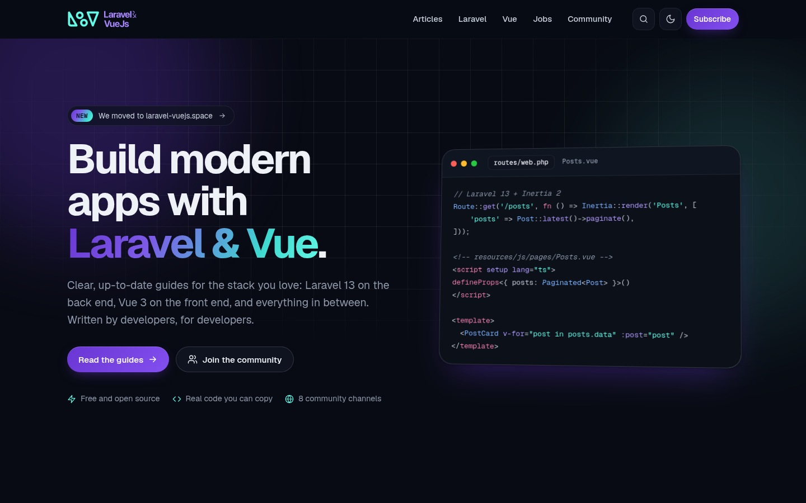

# Laravel & VueJs · laravel-vuejs.space

Open source blog and community for developers who build with **Laravel** and **Vue**: practical guides, community channels and a free jobs group. The site is a static [Astro](https://astro.build) build served from Cloudflare's edge.



## Stack

- **Astro 7**, static output, no UI framework: every page is plain HTML and CSS
- Hand-written CSS design system (`src/styles/global.css`) with light and dark themes
- **Geist** and **Geist Mono** (self-hosted through Fontsource)
- Markdown posts with build-time syntax highlighting (Shiki, light + dark themes)
- About 3 KB of JavaScript in total: theme toggle, copy buttons, table-of-contents highlight, search, link prefetch
- Cloudflare Workers static assets (`wrangler.jsonc`)

## Requirements

- Node.js >= 22.12 and npm

## Development

```bash
npm install
npm run dev       # http://localhost:4321
npm run build     # static site in dist/
npm run preview   # serve dist/
```

## Project layout

| Path | What it is |
| --- | --- |
| `src/pages/` | Routes: `index`, `[slug]` (posts), `posts`, `category/[slug]`, `tag/[slug]`, `page/*`, `jobs/*`, `search/*`, `auth/*`, `404`, plus `sitemap.xml`, `feed*.xml`, `robots.txt`, `manifest.webmanifest`, `api/posts.json` (search index) |
| `src/layouts/` | `Base.astro` (document head, SEO, JSON-LD, header, footer) and `Page.astro` (page hero + content) |
| `src/components/` | Logo, icons, header, footer, post card, generated cover art, archive, search, newsletter band |
| `src/styles/global.css` | Design tokens (brand palette, type, radii), components and both themes |
| `src/config/site.ts` | Domain, contact email, social channels, navigation and footer links |
| `src/content/posts/*.md` | Blog posts |
| `src/content/taxonomies.json` | Categories and tags |
| `public/og/` | Open Graph images (1200×630), generated by `scripts/og.mjs` |
| `wrangler.jsonc` | Cloudflare config |

## Brand

| Token | Value | Use |
| --- | --- | --- |
| Mint | `#63F9E6` | Logo mark, accents, glows |
| Purple | `#6936D3` | Logo wordmark, primary buttons, links |
| Slate | `#384457` | Neutrals |
| Mist | `#EBEEF2` | Neutrals, dark-mode text |

## Writing a post

Add a Markdown file to `src/content/posts/`. The file name is the URL (`my-post.md` is served at `/my-post`).

```md
---
id: 6                       # higher id = newer
title: "Typed props in Vue 3.5"
excerpt: "Shown on cards, in feeds and as the meta description."
date: 2026-10-12T09:00:00Z
updated: 2026-10-20T09:00:00Z   # optional
snippet: "npm create vue@latest" # optional, shown on the generated cover
featured: true
categories: [vuejs]         # slugs from taxonomies.json
tags: [vuejs, typescript]
---

Your article. `{{CONTACT_EMAIL}}` becomes the contact address from src/config/site.ts.
```

Then regenerate the Open Graph images (see the top of `scripts/og.mjs`).

### Scheduled publishing

A post whose `date` is in the future is left out of production builds: it does not appear in lists, feeds, the sitemap or the search index, and it has no page. You can merge it early. Every day at 07:05 UTC (15:05 MYT), the `Publish scheduled posts` workflow checks whether a post's date has passed and the live site still lacks it. If so, it triggers a production rebuild. It uses the `CF_DEPLOY_HOOK_URL` repo secret (a Workers Builds deploy hook for `master`) when that is set, and otherwise pushes an empty commit to `master`. You can also run the workflow by hand (Actions, then Run workflow, with `force` to rebuild anyway).

Future posts are included in Workers Builds previews (every branch except `master`), in PR CI and in local builds run with `SHOW_FUTURE_POSTS=1`, so they can be reviewed. Set `date` to the exact moment the post should go live, in UTC (for example `2026-10-13T07:00:00Z` = 15:00 MYT). It then appears with the next daily run.

## SEO and AI search

- **Titles and descriptions:** `<title>` stays within ~60 characters (the site name is added only when it fits; posts can set `seoTitle`). Meta descriptions default to the excerpt trimmed to 155 characters; posts can set `description`.
- **Structured data:** one JSON-LD `@graph` per page: `Organization` and `WebSite` (with a `SearchAction` for `/search?q=`) everywhere, `TechArticle`/`BlogPosting` + `Person` + `BreadcrumbList` on posts, `BreadcrumbList` on listing pages, `FAQPage` on the FAQ, `ProfilePage` on the author page.
- **Sitemaps:** `/sitemap.xml` is a sitemap index pointing at `/sitemap-pages.xml`, `/sitemap-posts.xml` and `/sitemap-taxonomies.xml`, with `lastmod` where we know it (legal pages use `LEGAL_UPDATED` in `src/lib/sitemap.ts`; bump it when you edit them).
- **Feeds:** `/feed.xml` (also `/feed/posts.xml`, `/feed/categories.xml`, `/feed/tags.xml`).
- **AI search / GEO:** `/llms.txt` (index), `/llms-full.txt` (full text of every article) and `/<slug>.md` (each post as clean Markdown; the Worker sends a `Link: rel="canonical"` header to the HTML page). `robots.txt` explicitly allows the main AI crawlers (`AI_CRAWLERS` in `src/config/site.ts`).
- **Author page:** `/author/anass-ez-zouaine` (E-E-A-T: who writes, how articles are tested and corrected). Keep it to verifiable facts.
- **Pagination:** `/posts` shows 12 articles; older ones move to `/posts/page/2`, `/posts/page/3`, ... with `rel=prev/next`.
- **IndexNow:** the key is `INDEXNOW_KEY` in `src/config/site.ts`, served at `/<key>.txt`. `.github/workflows/indexnow.yml` submits recently changed URLs after each deploy of master (run it manually with *all* to submit the whole sitemap), and the scheduled-publishing job pings new posts on their release day.

### Search Console and Bing Webmaster Tools (owner to-do)

1. **Google Search Console:** add the property. Easiest is a *Domain* property verified with a DNS TXT record in Cloudflare. For a URL-prefix property, choose *HTML tag* and paste only the `content` value into `GOOGLE_SITE_VERIFICATION` in `src/config/site.ts`, then push.
2. **Bing Webmaster Tools:** import the site from Search Console, or choose *HTML Meta Tag* and paste the value into `BING_SITE_VERIFICATION`.
3. In both, submit `https://laravel-vuejs.space/sitemap.xml`.

## Deploying

Pushes to `master` are deployed by Cloudflare Workers Builds; pull requests get a preview URL. Manual deploy:

```bash
npx wrangler login
npm run deploy
```

## Contributors

- [Anass Ez-zouaine](https://github.com/ansezz)
- [Othmane Gourirran](https://github.com/OthmanDev)
- [Omar Bourhaouta](https://github.com/bourhaouta)

Bug reports, ideas and pull requests are welcome.

## License

Open source under the [MIT license](https://opensource.org/licenses/MIT).

## Forms backend (Cloudflare Worker + D1 + Email Service)

`worker/index.ts` runs in front of the static assets (`run_worker_first: true`) and:

- redirects `www.laravel-vuejs.space` to the apex (301);
- handles `POST /api/forms/{contact|hire|newsletter|job}`: validation, honeypot (`website`), time trap (`ts`), same-site origin check and a per-IP rate limit (5 per 10 minutes, IPs stored only as salted SHA-256 hashes);
- stores submissions in D1 (`laravel-vuejs-forms`, schema in `migrations/`) and emails a notification from `noreply@laravel-vuejs.space` to `contact@laravel-vuejs.space` through the Cloudflare Email Service `send_email` binding (`EMAIL`), with Reply-To set to the sender; the result (`sent: <messageId>` or `failed: <code> <message>`) is stored in `email_status`;
- adds the security and cache headers (the `_headers` file is not applied when a Worker runs first).

Forms work without JavaScript (the Worker answers with a 303 to `/thanks` or `/form-error`); with JavaScript they post with `fetch` and show the result inline.

No API keys are needed for email: Email Sending must be enabled for `laravel-vuejs.space` in Cloudflare. Optional secret: `IP_SALT` (`npx wrangler secret put IP_SALT`).

Local development: `npm run db:migrate:local && npx wrangler dev`. Read submissions: `npx wrangler d1 execute laravel-vuejs-forms --remote --command "select * from submissions order by id desc limit 20"`.
