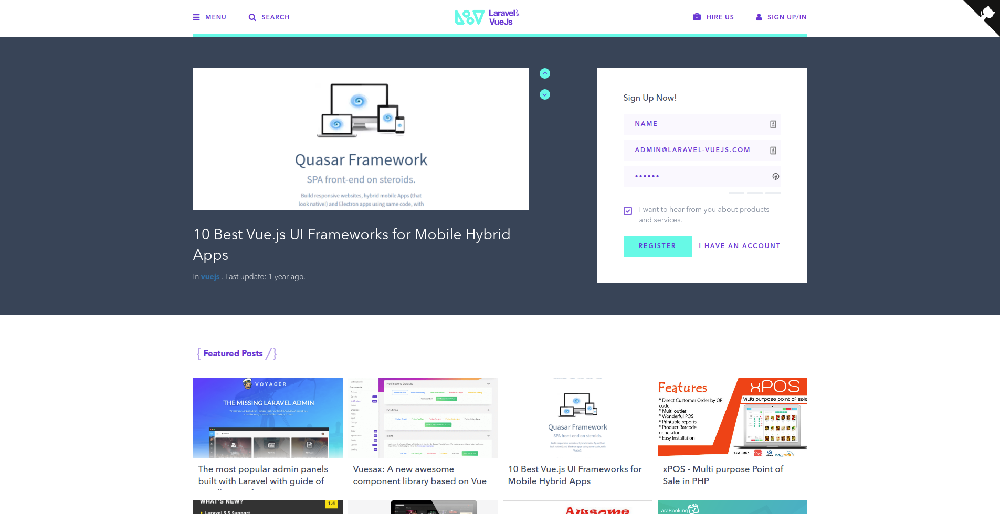

# Laravel & VueJs — laravel-vuejs.space

Open source blog about Laravel and VueJs, now a static [Astro](https://astro.build) site served from Cloudflare.

The original stack (Laravel 5 + Nova + Lighthouse GraphQL backend, Nuxt 2 / Vue 2 front in `front/`)
is still available on the `master` branch. This branch keeps the same design, markup, styles and copy:
the Nuxt components are reused as Vue 3 components through `@astrojs/vue`, and every page is
pre-rendered at build time.



## Requirements

- Node.js >= 22.12
- npm

## Development

```bash
npm install
npm run dev       # http://localhost:4321
npm run build     # static site in dist/
npm run preview   # serve dist/
```

Copy `.env.example` to `.env` to enable AdSense, Analytics, Tag Manager, the Search Console
verification tag, or a GraphQL endpoint for the forms. Everything is optional.

## Project layout

| Path | What it is |
| --- | --- |
| `src/pages/` | Astro routes, one per Nuxt page (`index`, `[slug]`, `posts`, `category/[slug]`, `tag/[slug]`, `page/*`, `jobs/*`, `auth/*`, `search/*`, `404`) plus `sitemap.xml`, `feed*.xml`, `robots.txt`, `manifest.webmanifest`, `api/posts.json` |
| `src/layouts/Base.astro` | Document head (the old `nuxt.config.js` head + `seo` mixin), global CSS, store state |
| `src/app/` | The Nuxt front, ported to Vue 3: `components/`, `views/`, `layouts/`, `assets/`, `config/` |
| `src/app/roots/` | One root component per page: the web layout wrapping a view |
| `src/app/lib/` | Small replacements for Nuxt modules: Vuex store, router / `<nuxt-link>`, Apollo, toast, lazy-load, swiper, Disqus, social sharing, Prism |
| `src/content/posts/*.md` | Blog posts (was the MySQL `posts` table) |
| `src/content/taxonomies.json` | Categories and tags |
| `src/app/config/site.js` | Site URL, name, contact email, Disqus id |
| `public/` | Static files (favicon, icon, ads.txt, post images under `storage/posts/`) |
| `wrangler.jsonc` | Cloudflare Workers static-assets config |

## Content

Posts are Markdown files with front matter:

```md
---
id: 6                     # higher id = newer (lists are sorted by id, like `latest('id')`)
title: "My post"
excerpt: "Shown in cards and meta description"
image: /storage/posts/my-post.jpg
date: 2026-10-01T10:00:00Z
featured: true
views: 0                  # used for the "popular" lists
categories: [laravel]     # slugs from taxonomies.json
tags: [laravel, vuejs]
---
```

`{{CONTACT_EMAIL}}` in a post is replaced with the address configured in `src/app/config/site.js`.

## Deploying to Cloudflare

The build is fully static, so it runs on Workers static assets with no Worker code:

```bash
npx wrangler login
npm run deploy          # wrangler deploy (runs `npm run build` first, see wrangler.jsonc)
```

See the pull request that introduced this branch for the full checklist (custom domain, DNS, Disqus).

## Contributors

- [Anass Ez-zouaine](https://github.com/ansezz)
- [Othmane Gourirran](https://github.com/OthmanDev)
- [Omar Bourhaouta](https://github.com/bourhaouta)

## Contributing

Do not hesitate to contribute to the project by adapting or adding features! Bug reports or pull requests are welcome.

## License

The project is open-sourced software licensed under the [MIT license](http://opensource.org/licenses/MIT).
